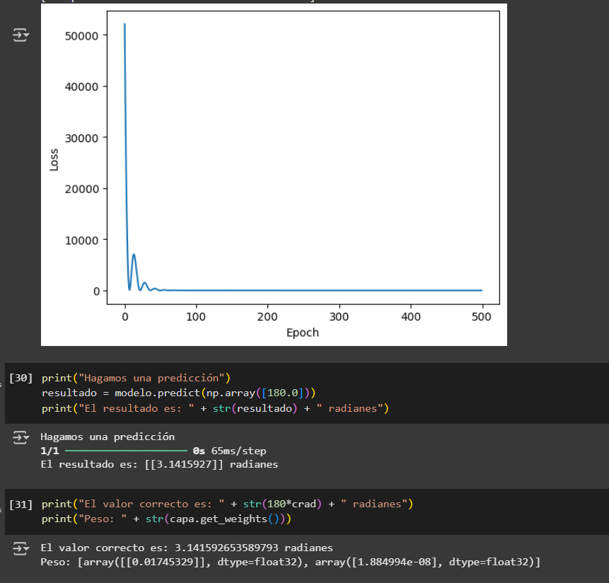

# MiPrimeraRedNeuronal

Creación de una red neuronal desde cero usando Python y Tensorflow.

Podemos usar [Google Colab](https://colab.research.google.com/) para no tener que instalar nada. 
[Cómo usar Google Colab](googleColabExp.md)

Anlizaremos cómo crearla y explicaremos cómo y por qué funciona, también veremos las diferencias entre el **APRENDIZAJE AUTOMÁTICO** y la **PROGRAMACIÓN REGULAR**.

-PROGRAMACIÓN REGULAR
Normalmente programámos algoritmos para que a partir de entradas generen resultados. Nosotros somos los encargados de escribir las reglas e instrucciones a seguir para llegar a esos resultados.

-APRENDIZAJE AUTOMÁTICO
Poseemos las entradas y los resultados pero no necesariamente sabemos cómo a partir de esas entradas obtenemos esos resultados. Es decir no conocemos el algoritmo usado.

OBJETIVO: 
Lo que pretendemos hacer en este proyecto es crear un modelo que pueda a partir de ciertas entradas obtener los resultados esperados de cada una y que pueda aprender por si solo el algoritmo necesario para obtenerlos.

Por ejemplo, queremos convertir grados a radianes. Radianes = grados x pi/180.

# En programación regular podríamos usar una funcion como esta:

    import math
    pi = math.pi

    def function(G):
        return G * (pi/180)

# Usando aprendizaje automático:
Suponemos que no conocemos la fórmula de conversión, solo contamos con un número de entradas con sus correspondientes salidas.

                                            | GRADOS  |RADIANES |
                                            |---------|---------|
                                            | 10      | 0.1745  |
                                            | 100     | 1.7453  |
                                            | -75     | -1.3089 |
                                            | 0       | 0       |
                                            | 824     | 14.3815 |
                                            | 120     | 2.0943  |
                                            | -120    | -2.0943 |

Nuestra red neuronal será la más simple que hay.

-REGLAS QUE SIGUEN:

Las redes neuronales se separan en capas, cada una puede tener una o más neuronas pero siempre tienen una capa de entrada (donde se reciven los datos de entrada) y una capa de salida (donde obtenemos el resultado calculado). En redes más complejas pueden haber capas ocultas.

Las neuronas se conectan con conexiones, en nuestro caso solo tenemos una conexión que conecta la neurona de entrada con la de salida. Cada una de las conexiones tiene un peso asignado que representa la importancia de la conexión entre las neuronas.

Cada neurona (menos la de entrada) tiene un sesgo (valor numérico).

                            | ENTRADA | SALIDA |
                            |---------|--------|
                            |                  |
                            |      2.3         |
                            |  G ------> R(5)  |
                            |                  |

# Funcionamiento

Colocaremos los grados en la primera neurona (la de entrada), esos grados se multiplicaran por el peso de la conexión y llegarán a la siguiente neurona (la de salida) ahí se le sumará el sesgo y nos dará nuestro resultado.
Inicialmente el peso y el sesgo se asigna de forma aleatoria por lo que los primeros resultados no son para nada coherentes.

Ejemplo:    

                            | ENTRADA | SALIDA |
                            |---------|--------|
                            |                  |
                            |       2.3        |
                            |  120 ----> R(5)  |
                            |                  |

G = 120     Conexion = 2.3   Sesgo = 5

Resultado = 120 * 2.3 + 5
Resultado  ->   281

Para el correcto funcionamiento y conseguir la mejor aproximación, necesitamos muchos ejemplos.
Se los daremos a la red y ella aprenderá la relación ajustando automáticamente los pesos y sesgos. Esto lo consigue tomando todos los valores de entrada y por cada uno hará una predicción, si por ejemplo le va muy mal, se ajustará mucho (hará variar mucho el sesgo y el peso) pero si no le fue tan mal, se ajustará poco.

# Código limpio de la red neuronal
[Código limpio](redNeuronal.py)

# Código con explicaciones detalladas
[Código explicado](redNeuronalExpl.py)

# Imagen con los resultados obtenidos

Creditos: @Ringa Tech
