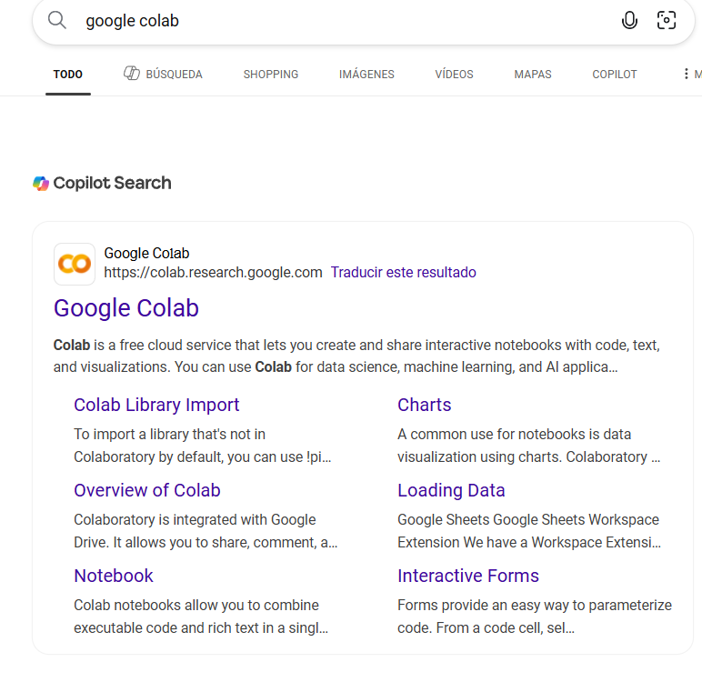

# CÓMO USAR GOOGLE COLAB PARA EL PROYECTO
-¿Qué es google colab?
Es una herramienta gratuira de Google que nos permite escribir y ejecutar código en Python directamente desde un navegador, sin necesidad de instalar nada. Funciona como un entorno basado en la nube similar a Jupyter Notebooks. Es decir una computadora en la nube.

Sólo necesitamos una cuenta de google.

